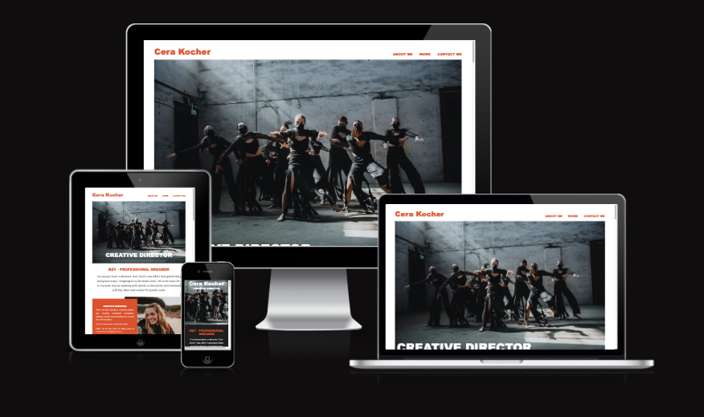
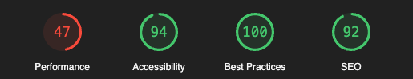

# brainnest-portfolio
# Portfolio about Cera as Creative Director and Proffssional Dreamer 
<picture>
 <source media="(prefers-color-scheme: light)"          srcset="YOUR-LIGHTMODE-IMAGE">
 
</picture>

 

# Visit the website: https://juniperfawn.github.io/brainnest-portfolio/ 
 
 

# How we Deployed our website
* ## Brainnes-portfolio Repository

* ## Deploy the repository to github Page

 
 

# Client Order.
<picture>
 <source media="(prefers-color-scheme: light)" srcset="YOUR-LIGHTMODE-IMAGE">
 
</picture>

 
 

#  Ligthouse checker 

* Performance   speed which website  upload and shows on the browser 
* Accsessbillity   for disabilie people to navigate website
* Best pratice   has to do with how it carry out a task or configure.
* SEO   Optimise for search engine, to improve traffic visit to website

<picture>
 <source media="(prefers-color-scheme: light)" srcset="YOUR-LIGHTMODE-IMAGE">
 
</picture>

 
 

# Used Technologies
##  We used discord as our communiton.

 
 

# Our Participant who contributet to development of the website
### Team Members: 

live Site: https://juniperfawn.github.io/brainnest-portfolio/

Team Members: 

-António José Mata Quaresma 
-Cera Kocher 
-Lucas Coutinho de Assis 
-Kerry Jalal  
